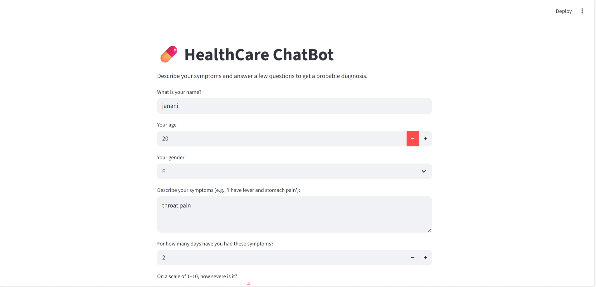
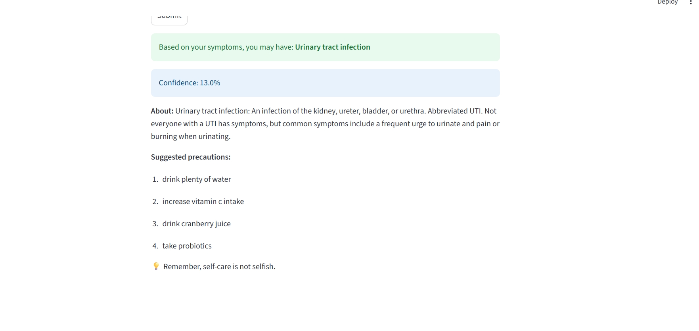

# 💊 HealthCare ChatBot  

An interactive AI-powered chatbot built with **Machine Learning** and **Streamlit** that predicts possible diseases based on user symptoms. The chatbot analyzes inputs, provides a probable diagnosis, and suggests precautions — making health awareness simple and accessible.  

---

## Features  
- Symptom-based prediction using trained ML model (Random Forest).  
- Handles synonyms & fuzzy matches for flexible symptom inputs.  
- Displays probability/confidence score of the prediction.  
- Provides description of the predicted disease.  
- Suggests useful precautions for health management.  
- User-friendly interface powered by Streamlit.  

---

## Tools & Technologies  
- **Python**  
- **Pandas, NumPy, scikit-learn**  
- **Random Forest Classifier**  
- **Streamlit**  
- **CSV Datasets (Symptoms, Precautions, Descriptions)**  

---


## Dataset Information

- **Training.csv** – Dataset used to train the chatbot model  
- **Testing.csv** – Dataset used to validate model accuracy  
- **MasterData/** – Metadata for symptoms including:
  - `symptom_Description.csv` – Details about each symptom  
  - `symptom_precaution.csv` – Recommended precautions  
  - `symptom_severity.csv` – Severity score of each symptom  
---

## Demo Screenshots  

### Home Page  
  

### Prediction Example  
 

---

## How to Run Locally  

1. Clone the repo:  
   ```bash
   git clone https://github.com/Your-username/Healthcare_Chatbot
   cd Healthcare_chatbot
 
2. Install dependencies
   ```bash
   pip install -r requirements.txt

3. Run the Streamlit app
   ```bash
   streamlit run app.py

4. Open in your browser
   http://localhost:8501

 


